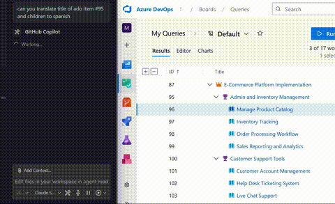

# Azure DevOps VS Code Extension

A VS Code extension that provides Azure DevOps integration with secure authentication and chat tools for managing projects and work items.

**Disclaimer**: 

**THIS IS A DEMO. YOU SHOULD NOT USE THIS.**

**USE AT YOUR OWN RISK** - This extension is provided "as is" without warranty of any kind. Users assume all responsibility for any data loss, security issues, or other consequences that may result from using this extension.

**INTERNAL USE ONLY** - This extension is intended for internal organizational use only and should not be distributed or used outside of your organization without proper review and authorization.

**NOT AFFILIATED WITH MICROSOFT** - This extension is an independent project and is not affiliated with, endorsed by, or supported by Microsoft Corporation. Microsoft, Azure DevOps, Visual Studio Code, and related trademarks are property of Microsoft Corporation.

**NO SUPPORT OR WARRANTIES** - This software is provided without any express or implied warranties, including but not limited to warranties of merchantability, fitness for a particular purpose, or non-infringement. The authors and contributors are not responsible for any damages or issues arising from the use of this extension.

**SECURITY NOTICE** - While this extension implements security best practices, users should review the code and ensure it meets their organization's security requirements before use in production environments.




## Features

### 🔐 Secure Authentication
- **Microsoft Authentication Library (MSAL)** integration for secure Azure DevOps authentication
- Uses VS Code's secure secret storage for token management
- Supports the same authentication flow as other Microsoft VS Code extensions
- Device code flow for secure authentication without embedded browser

### 🛠️ Chat Tools Integration
- **Azure DevOps Login**: Authenticate with Azure DevOps from the chat interface
- **List Projects**: Get all projects in your organization
- **Work Items**: View and create work items (bugs, tasks, user stories, etc.)

### ⚙️ Commands
- `Azure DevOps: Set Organization` - Configure your Azure DevOps organization URL
- `Azure DevOps: Sign In` - Authenticate with Azure DevOps
- `Azure DevOps: Sign Out` - Sign out and clear stored credentials
- `Azure DevOps: Test Connection` - Test your connection to Azure DevOps
- `Azure DevOps: Show Status` - View current authentication and connection status
- `Azure DevOps: Toggle Readonly Mode` - Enable/disable readonly mode to prevent write operations

### 🔒 Readonly Mode
The extension includes a **readonly mode** feature that provides a safe way to browse Azure DevOps data without risking accidental modifications.

When readonly mode is enabled:
- All write operations are blocked (create, update, delete work items and comments)
- View and read operations continue to work normally
- Clear warnings are shown when attempting write operations
- The status is displayed in the "Azure DevOps: Show Status" command

**Usage:**
- Use `Azure DevOps: Toggle Readonly Mode` command to enable/disable
- Configure the default setting in VS Code settings: `azureDevOpsTools.readonly`
- Perfect for demo environments, production troubleshooting, or when you want to explore data safely

**Protected Operations:**
- Creating work items (individual, batch, tree structures)
- Updating work items 
- Deleting work items
- Adding, updating, or deleting work item comments
- Reverting work items to previous revisions

## Getting Started

### 1. Install the Extension
Install the extension from the VSIX file or VS Code marketplace.

### 2. Configure Your Organization
1. Open the Command Palette (`Ctrl+Shift+P` or `Cmd+Shift+P`)
2. Run `Azure DevOps: Set Organization`
3. Enter your Azure DevOps organization URL:
   - `https://dev.azure.com/yourorganization`
   - or `https://yourorganization.visualstudio.com`

### 3. Sign In
1. Run `Azure DevOps: Sign In` from the Command Palette
2. Follow the device code authentication flow:
   - A notification will show with a URL and code
   - Click "Open Browser" to open the authentication page
   - Enter the provided code and complete the sign-in process

### 4. Use Chat Tools
Once authenticated, you can use the Azure DevOps tools in VS Code Chat:

```
@workspace #azure-devops_login
@workspace #azure-devops_projects
@workspace #azure-devops_workitems projectName:"MyProject"
@workspace #azure-devops_create-workitem projectName:"MyProject" workItemType:"Task" title:"New task"
```

## Security Features

### Token Management
- Tokens are stored securely using VS Code's `SecretStorage` API
- Automatic token refresh when expired
- Secure token cleanup on sign-out

### Authentication Flow
- Uses Microsoft's recommended device code flow for desktop applications
- Same authentication mechanism as other Microsoft VS Code extensions
- No embedded browsers or insecure token handling

### API Security
- Proper base64 encoding of tokens for Azure DevOps API
- HTTPS-only communication
- Follows Azure DevOps REST API security best practices

## Installation

```bash
code --install-extension adzo-tools-0.1.0.vsix
```

## Authentication Details

This extension uses the same authentication approach as other Microsoft VS Code extensions:

- **Client ID**: `872cd9fa-d31f-45e0-9eab-6e460a02d1f1` (Visual Studio client ID)
- **Scope**: `499b84ac-1321-427f-aa17-267ca6975798/.default` (Azure DevOps scope)
- **Flow**: Device Code Flow for secure desktop authentication
- **Token Storage**: VS Code SecretStorage API

## Troubleshooting

### Chat Tools Not Working
If Copilot says it cannot execute Azure DevOps tools like `#azure-devops_create-workitem`:

1. **Check Extension Installation**: Ensure the extension is properly installed and activated
   ```bash
   code --install-extension basic-mcp-extension-0.1.0.vsix
   ```

2. **Reload VS Code**: After installation, reload the window
   - Press `Ctrl+Shift+P` (or `Cmd+Shift+P`)
   - Run `Developer: Reload Window`

3. **Check Authentication**: Make sure you're signed in
   ```
   @workspace #azure-devops_login
   ```

4. **Verify Organization**: Ensure your organization URL is set
   - Run `Azure DevOps: Show Status` from Command Palette
   - Or set it with `Azure DevOps: Set Organization`

5. **Test Basic Connectivity**: Try simpler tools first
   ```
   @workspace #azure-devops_projects
   ```

### Authentication Issues
1. Run `Azure DevOps: Show Status` to check your authentication status
2. Try `Azure DevOps: Sign Out` and sign in again
3. Ensure your organization URL is correct

### Connection Issues
1. Run `Azure DevOps: Test Connection` to verify connectivity
2. Check that you have access to the Azure DevOps organization
3. Verify your network connection and proxy settings
